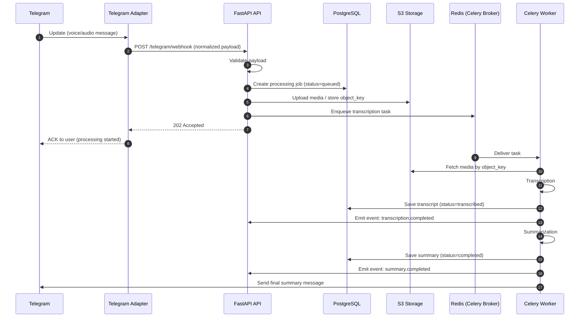

# Архитектурный поток обработки Telegram-аудио

## 1) Компоненты системы

### Telegram Adapter
- Принимает `update`-события от Telegram (webhook/long polling).
- Нормализует входящие данные (`chat_id`, `user_id`, `message_id`, `file_id`, `mime_type`, `duration`).
- Выполняет базовую валидацию структуры update до передачи в API-слой.
- Выступает анти-коррупционным слоем между Telegram Bot API и внутренним доменом.

### FastAPI API
- Точка входа HTTP и оркестратор синхронной части пайплайна.
- Валидирует входные payload через Pydantic-модели.
- Делегирует бизнес-логику в service-слой (`router -> service -> repository`).
- Регистрирует и публикует внутренние события через `fastapi-events`.
- Возвращает пользователю быстрый ACK (без ожидания долгих вычислений).

### Celery Worker
- Выполняет тяжелые асинхронные задачи:
  - скачивание/предобработка медиа,
  - транскрипция,
  - суммаризация,
  - сборка и отправка итогового ответа.
- Потребляет задачи из Redis-брокера.
- Пишет результаты и статусы в PostgreSQL.
- Публикует доменные события завершения этапов.

### Redis
- Broker/Backend для Celery.
- Буферизует задания, разгружая request path FastAPI.
- Позволяет безопасные ретраи и повторное выполнение идемпотентных задач.

### PostgreSQL
- Источник истины для:
  - пользователей/чатов,
  - задач обработки,
  - статусов пайплайна,
  - метаданных медиа и текстовых артефактов.
- Используется repository-слоем для чтения/записи.

### S3-совместимое хранилище
- Долговременное хранение исходных и производных файлов:
  - оригинальные аудио,
  - нормализованные медиа,
  - при необходимости артефакты транскрипции.
- API/воркер работают с объектами по ключам, а не с локальными путями.

---

## 2) Поток данных

1. **Telegram update** приходит в Telegram Adapter.
2. Adapter передает нормализованный payload в endpoint FastAPI.
3. FastAPI валидирует вход и создает запись задачи в PostgreSQL.
4. Медиа загружается в S3-совместимое хранилище (с сохранением `object_key`).
5. FastAPI ставит задачу в Celery (через Redis) и возвращает ACK пользователю.
6. Celery Worker выполняет **транскрипцию** и сохраняет результат в PostgreSQL.
7. По завершении транскрипции публикуется событие `transcription.completed`.
8. Worker запускает **суммаризацию**, сохраняет результат в PostgreSQL.
9. По завершении публикуется событие `summary.completed`.
10. Worker (или подписчик на событие) отправляет ответ в Telegram-пользователю.

---

## 3) Разделение по слоям (`router -> service -> repository`)

### Router layer (FastAPI routers)
- Ответственность:
  - HTTP/Telegram boundary,
  - парсинг и валидация request,
  - маппинг ошибок в HTTP-ответы,
  - вызов service-методов.
- Не содержит SQL-запросов и доменной оркестрации.

### Service layer
- Ответственность:
  - бизнес-процессы и orchestration,
  - транзакционные сценарии,
  - постановка задач в Celery,
  - публикация событий через `fastapi-events`.
- Не знает деталей HTTP и не формирует transport-ответы.

### Repository layer
- Ответственность:
  - операции чтения/записи в PostgreSQL,
  - инкапсуляция SQLModel/SQLAlchemy запросов,
  - возврат доменных сущностей/DTO для service.
- Не содержит бизнес-правил и внешних интеграций.

---

## 4) Формат внутренних событий (`fastapi-events`)

События фиксируются в едином envelope-формате:

```json
{
  "event_name": "transcription.completed",
  "event_id": "evt_01J0ABCDEF1234567890",
  "occurred_at": "2026-03-01T12:34:56Z",
  "correlation_id": "c2f3a6f4b1f54a8f9e62c2d38d1d5c7b",
  "source": "celery.worker.transcription",
  "payload": {
    "job_id": "job_01J0AAAAAA1111111111",
    "user_id": 12345,
    "chat_id": 67890,
    "message_id": 13579,
    "transcript_id": "tr_01J0BBBBBB2222222222",
    "language": "ru",
    "duration_sec": 182,
    "text_length": 934
  },
  "meta": {
    "schema_version": 1
  }
}
```

### Событие: `transcription.completed`
- `payload` (минимум):
  - `job_id: str`
  - `chat_id: int`
  - `message_id: int`
  - `transcript_id: str`
  - `duration_sec: int`
  - `text_length: int`

### Событие: `summary.completed`
- `payload` (минимум):
  - `job_id: str`
  - `chat_id: int`
  - `message_id: int`
  - `summary_id: str`
  - `summary_length: int`
  - `model: str`

Рекомендации:
- `event_name` в формате `<bounded_context>.<action>` или `<artifact>.<state>`.
- Все события должны содержать `correlation_id` для сквозной трассировки.
- Ошибки обработчиков событий не должны ломать request path.

---

## 5) Диаграмма последовательности


